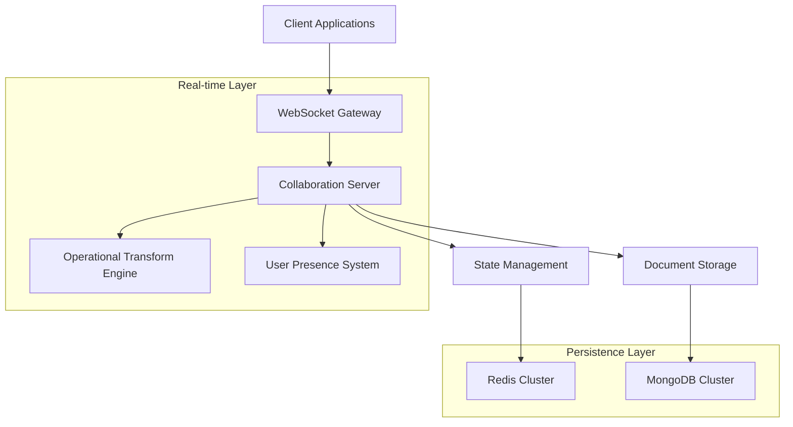

# Real-Time Collaborative Editing System Specification

**Generated:** 2025-08-22 12:07:30  
**Repository:** kevinmwilder/technical-specs  
**Integration:** GitHub MCP  
**Document Type:** Technical Specification  
**Prompt:** Design a technical specification for implementing real-time collaborative editing functionality

---

## Overview

This specification outlines the technical implementation of a real-time collaborative editing system that allows multiple users to simultaneously edit documents with conflict resolution, user presence awareness, and synchronized state management.

## System Architecture

### High-Level Components



### Core Technology Stack

| Component | Technology | Justification |
|-----------|------------|---------------|
| WebSocket Gateway | Socket.io | Mature, fallback support, room management |
| Backend Server | Node.js + Express | JavaScript ecosystem, async I/O |
| Operational Transform | ShareJS/Y.js | Proven OT implementation |
| Real-time Database | Redis Cluster | In-memory speed, pub/sub support |
| Document Storage | MongoDB | Document-oriented, flexible schema |
| Message Queue | RabbitMQ | Reliable message delivery |
| Load Balancer | NGINX | WebSocket proxy support |

## Detailed Component Specifications

### 1. WebSocket Gateway

```typescript
interface WebSocketGateway {
  // Connection Management
  handleConnection(socket: Socket): void;
  handleDisconnection(socket: Socket): void;
  
  // Room Management  
  joinDocument(socketId: string, documentId: string): Promise<void>;
  leaveDocument(socketId: string, documentId: string): Promise<void>;
  
  // Message Routing
  broadcastOperation(documentId: string, operation: Operation, excludeSocket?: string): void;
  sendToUser(userId: string, message: Message): void;
}

class SocketGateway implements WebSocketGateway {
  private io: SocketIOServer;
  private collaborationService: CollaborationService;
  
  constructor(server: HttpServer) {
    this.io = new SocketIOServer(server, {
      cors: {
        origin: process.env.ALLOWED_ORIGINS?.split(','),
        credentials: true
      },
      transports: ['websocket', 'polling']
    });
    
    this.setupEventHandlers();
  }
  
  private setupEventHandlers(): void {
    this.io.on('connection', (socket) => {
      // Authentication
      socket.on('authenticate', async (token) => {
        const user = await this.authenticateUser(token);
        if (user) {
          socket.userId = user.id;
          socket.emit('authenticated', user);
        } else {
          socket.disconnect();
        }
      });
      
      // Document operations
      socket.on('join-document', async (documentId) => {
        await this.joinDocument(socket.id, documentId);
      });
      
      socket.on('operation', async (data) => {
        await this.handleOperation(socket, data);
      });
      
      // Cursor tracking
      socket.on('cursor-update', (data) => {
        this.broadcastCursorUpdate(socket, data);
      });
    });
  }
}
```

### 2. Operational Transform Engine

The system implements Operational Transformation (OT) for conflict resolution:

```typescript
interface Operation {
  type: 'insert' | 'delete' | 'retain';
  position: number;
  content?: string;
  length?: number;
  author: string;
  timestamp: number;
  revision: number;
}

interface OperationalTransform {
  transform(op1: Operation, op2: Operation): [Operation, Operation];
  apply(document: Document, operation: Operation): Document;
  compose(ops: Operation[]): Operation;
}

class OTEngine implements OperationalTransform {
  transform(op1: Operation, op2: Operation): [Operation, Operation] {
    // Implementation based on operational transformation algorithm
    if (op1.type === 'insert' && op2.type === 'insert') {
      return this.transformInsertInsert(op1, op2);
    } else if (op1.type === 'insert' && op2.type === 'delete') {
      return this.transformInsertDelete(op1, op2);
    } else if (op1.type === 'delete' && op2.type === 'insert') {
      return this.transformDeleteInsert(op1, op2);
    } else if (op1.type === 'delete' && op2.type === 'delete') {
      return this.transformDeleteDelete(op1, op2);
    }
    
    return [op1, op2];
  }
  
  private transformInsertInsert(op1: Operation, op2: Operation): [Operation, Operation] {
    if (op1.position <= op2.position) {
      return [
        op1,
        { ...op2, position: op2.position + (op1.content?.length || 0) }
      ];
    } else {
      return [
        { ...op1, position: op1.position + (op2.content?.length || 0) },
        op2
      ];
    }
  }
  
  private transformInsertDelete(op1: Operation, op2: Operation): [Operation, Operation] {
    if (op1.position <= op2.position) {
      return [
        op1,
        { ...op2, position: op2.position + (op1.content?.length || 0) }
      ];
    } else if (op1.position >= op2.position + (op2.length || 0)) {
      return [
        { ...op1, position: op1.position - (op2.length || 0) },
        op2
      ];
    } else {
      // Insert position is within the delete range
      return [
        { ...op1, position: op2.position },
        { ...op2, length: (op2.length || 0) + (op1.content?.length || 0) }
      ];
    }
  }
  
  apply(document: Document, operation: Operation): Document {
    let content = document.content;
    
    switch (operation.type) {
      case 'insert':
        content = content.slice(0, operation.position) + 
                 operation.content + 
                 content.slice(operation.position);
        break;
        
      case 'delete':
        content = content.slice(0, operation.position) + 
                 content.slice(operation.position + (operation.length || 0));
        break;
        
      case 'retain':
        // No changes to content for retain operations
        break;
    }
    
    return {
      ...document,
      content,
      revision: operation.revision,
      lastModified: new Date()
    };
  }
}
```

### 3. State Management System

```typescript
interface DocumentState {
  id: string;
  content: string;
  revision: number;
  operations: Operation[];
  activeUsers: UserSession[];
  lastModified: Date;
}

interface UserSession {
  userId: string;
  socketId: string;
  cursor: CursorPosition;
  lastSeen: Date;
  color: string;
}

interface CursorPosition {
  line: number;
  column: number;
  selection?: {
    start: { line: number; column: number };
    end: { line: number; column: number };
  };
}

class StateManager {
  private redis: RedisCluster;
  private documents: Map<string, DocumentState>;
  
  constructor(redisConfig: RedisConfig) {
    this.redis = new RedisCluster(redisConfig);
    this.documents = new Map();
  }
  
  async getDocument(documentId: string): Promise<DocumentState | null> {
    // Check memory cache first
    if (this.documents.has(documentId)) {
      return this.documents.get(documentId)!;
    }
    
    // Load from Redis
    const cached = await this.redis.get(`doc:${documentId}`);
    if (cached) {
      const state = JSON.parse(cached) as DocumentState;
      this.documents.set(documentId, state);
      return state;
    }
    
    // Load from persistent storage
    return await this.loadFromDatabase(documentId);
  }
  
  async applyOperation(documentId: string, operation: Operation): Promise<void> {
    const state = await this.getDocument(documentId);
    if (!state) throw new Error('Document not found');
    
    // Apply operational transformation if needed
    const transformedOp = await this.transformOperation(state, operation);
    
    // Apply operation to document
    const otEngine = new OTEngine();
    const updatedDoc = otEngine.apply(state, transformedOp);
    
    // Update state
    state.content = updatedDoc.content;
    state.revision = transformedOp.revision;
    state.operations.push(transformedOp);
    state.lastModified = new Date();
    
    // Persist changes
    await this.persistState(documentId, state);
    
    // Broadcast to other users
    await this.broadcastOperation(documentId, transformedOp);
  }
  
  private async transformOperation(state: DocumentState, operation: Operation): Promise<Operation> {
    const otEngine = new OTEngine();
    let transformedOp = operation;
    
    // Transform against all operations since the client's revision
    const pendingOps = state.operations.filter(op => op.revision > operation.revision);
    
    for (const pendingOp of pendingOps) {
      const [transformed] = otEngine.transform(transformedOp, pendingOp);
      transformedOp = transformed;
    }
    
    transformedOp.revision = state.revision + 1;
    return transformedOp;
  }
}
```

### 4. User Presence System

```typescript
interface PresenceManager {
  addUser(documentId: string, user: UserSession): Promise<void>;
  removeUser(documentId: string, userId: string): Promise<void>;
  updateCursor(documentId: string, userId: string, cursor: CursorPosition): Promise<void>;
  getActiveUsers(documentId: string): Promise<UserSession[]>;
}

class PresenceService implements PresenceManager {
  private redis: RedisCluster;
  private cursorColors: string[] = [
    '#FF6B6B', '#4ECDC4', '#45B7D1', '#96CEB4',
    '#FFEAA7', '#DDA0DD', '#98D8C8', '#F7DC6F'
  ];
  
  async addUser(documentId: string, user: UserSession): Promise<void> {
    // Assign a color if not set
    if (!user.color) {
      user.color = await this.assignColor(documentId);
    }
    
    // Add to Redis set
    await this.redis.hset(
      `presence:${documentId}`,
      user.userId,
      JSON.stringify(user)
    );
    
    // Set expiration for automatic cleanup
    await this.redis.expire(`presence:${documentId}`, 3600);
    
    // Broadcast presence update
    await this.broadcastPresenceUpdate(documentId, 'user-joined', user);
  }
  
  async updateCursor(documentId: string, userId: string, cursor: CursorPosition): Promise<void> {
    const userKey = `presence:${documentId}`;
    const userData = await this.redis.hget(userKey, userId);
    
    if (userData) {
      const user = JSON.parse(userData) as UserSession;
      user.cursor = cursor;
      user.lastSeen = new Date();
      
      await this.redis.hset(userKey, userId, JSON.stringify(user));
      
      // Broadcast cursor update
      await this.broadcastCursorUpdate(documentId, userId, cursor);
    }
  }
  
  private async assignColor(documentId: string): Promise<string> {
    const activeUsers = await this.getActiveUsers(documentId);
    const usedColors = activeUsers.map(u => u.color);
    
    // Find first available color
    const availableColor = this.cursorColors.find(color => !usedColors.includes(color));
    return availableColor || this.cursorColors[0];
  }
}
```

## Performance Requirements

### Latency Targets
- **Operation Propagation**: < 100ms (95th percentile)
- **Connection Establishment**: < 500ms
- **Cursor Updates**: < 50ms
- **Document Loading**: < 2 seconds

### Scalability Targets
- **Concurrent Users per Document**: 100
- **Total Concurrent Connections**: 10,000
- **Documents**: 1 million active documents
- **Operations per Second**: 10,000

### Availability Requirements
- **Uptime**: 99.9% (8.76 hours downtime per year)
- **Recovery Time**: < 5 minutes
- **Data Durability**: 99.999999999% (11 9's)

## Security Specifications

### Authentication & Authorization
```typescript
interface SecurityPolicy {
  authentication: 'JWT' | 'OAuth2' | 'Session';
  authorization: 'RBAC' | 'ABAC';
  encryption: {
    transport: 'TLS_1.3';
    atRest: 'AES_256_GCM';
  };
  audit: {
    operations: boolean;
    userActions: boolean;
    dataAccess: boolean;
  };
}

class SecurityService {
  async authenticateWebSocket(token: string): Promise<User | null> {
    try {
      const decoded = jwt.verify(token, process.env.JWT_SECRET!);
      return await this.getUserById(decoded.userId);
    } catch (error) {
      return null;
    }
  }
  
  async authorizeDocumentAccess(userId: string, documentId: string, action: string): Promise<boolean> {
    const permissions = await this.getUserPermissions(userId, documentId);
    return permissions.includes(action);
  }
  
  encryptOperation(operation: Operation): EncryptedOperation {
    const key = this.deriveKey(operation.documentId);
    const encrypted = crypto.encrypt(JSON.stringify(operation), key);
    return { ...operation, content: encrypted };
  }
}
```

### Data Protection
- **Encryption in Transit**: TLS 1.3 for all connections
- **Encryption at Rest**: AES-256-GCM for stored documents
- **Access Control**: Role-based permissions with fine-grained document access
- **Audit Logging**: Complete audit trail of all operations and access

## Monitoring & Observability

### Metrics Collection
```yaml
metrics:
  application:
    - active_connections
    - operations_per_second
    - average_latency
    - error_rate
    - document_concurrent_users
  
  infrastructure:
    - cpu_usage
    - memory_usage
    - network_io
    - disk_io
    - redis_memory_usage
  
  business:
    - daily_active_users
    - documents_created
    - collaboration_sessions
    - user_retention
```

### Alerting Rules
- **High Latency**: > 200ms average for 5 minutes
- **Error Rate**: > 1% for 2 minutes  
- **Connection Drops**: > 5% in 1 minute
- **Memory Usage**: > 80% for 10 minutes
- **Redis Latency**: > 10ms for 5 minutes

## Deployment Architecture

### Infrastructure Requirements
```yaml
production:
  web_servers:
    count: 3
    specs: 4_cpu_16gb_ram
    load_balancer: nginx_with_websocket_support
  
  application_servers:
    count: 6
    specs: 8_cpu_32gb_ram
    auto_scaling: true
    min_instances: 6
    max_instances: 20
  
  redis_cluster:
    nodes: 6
    specs: 4_cpu_16gb_ram_ssd
    replication: 3_master_3_replica
  
  mongodb_cluster:
    nodes: 3
    specs: 8_cpu_64gb_ram_nvme
    configuration: replica_set
  
  message_queue:
    service: rabbitmq_cluster
    nodes: 3
    specs: 2_cpu_8gb_ram
```

### Deployment Pipeline
1. **Development**: Feature branches with automated testing
2. **Staging**: Full environment replica with synthetic load testing
3. **Production**: Blue-green deployment with health checks
4. **Monitoring**: Comprehensive observability from deployment

## Testing Strategy

### Unit Testing
- **Coverage Target**: 90%
- **Framework**: Jest + Supertest
- **Components**: OT Engine, State Manager, Security Service

### Integration Testing
- **WebSocket Connections**: Socket.io client testing
- **Database Operations**: Redis and MongoDB integration
- **Message Queue**: RabbitMQ integration testing

### Load Testing
- **Tool**: Artillery.io
- **Scenarios**: 
  - 1000 concurrent users editing single document
  - 10,000 concurrent connections across multiple documents
  - Sustained load over 24 hours

### End-to-End Testing
- **Framework**: Playwright
- **Scenarios**: Multi-user collaboration workflows
- **Browsers**: Chrome, Firefox, Safari, Edge

## Implementation Timeline

```gantt
title Real-Time Collaboration Implementation
dateFormat YYYY-MM-DD
section Phase 1
Core Architecture      :done, arch, 2025-01-01, 2025-02-15
WebSocket Gateway      :done, ws, 2025-02-01, 2025-03-01
Basic OT Engine        :active, ot, 2025-03-01, 2025-04-01

section Phase 2
State Management       :state, 2025-04-01, 2025-05-01
User Presence         :presence, 2025-04-15, 2025-05-15
Security Layer        :security, 2025-05-01, 2025-06-01

section Phase 3
Performance Optimization :perf, 2025-06-01, 2025-07-01
Monitoring & Alerts     :monitor, 2025-06-15, 2025-07-15
Production Deployment   :deploy, 2025-07-15, 2025-08-01
```

## Risk Assessment & Mitigation

| Risk | Probability | Impact | Mitigation Strategy |
|------|-------------|--------|-------------------|
| OT Algorithm Bugs | Medium | High | Extensive testing, proven library usage |
| Scale Issues | Medium | High | Load testing, gradual rollout |
| Data Loss | Low | Critical | Multiple backups, replication |
| Security Vulnerabilities | Medium | High | Security audits, penetration testing |
| Browser Compatibility | Low | Medium | Comprehensive cross-browser testing |

---

## Conclusion

This technical specification provides a comprehensive blueprint for implementing a production-ready real-time collaborative editing system. The architecture prioritizes reliability, performance, and security while ensuring scalability for enterprise use.

Key implementation success factors:
- Robust operational transformation implementation
- Comprehensive testing at all levels  
- Scalable infrastructure design
- Strong security and monitoring foundations
- Phased deployment approach

**Next Steps:**
1. Proof of concept development (2 weeks)
2. Core system implementation (8 weeks)
3. Security hardening and testing (4 weeks)
4. Production deployment and monitoring (2 weeks)

---

## Metadata

```json
{
  "specification_version": "1.0",
  "timestamp": "2025-08-22T16:07:30Z",
  "author": "azure_ai_foundry",
  "repository": "kevinmwilder/technical-specs",
  "document_type": "technical_specification",
  "complexity": "high",
  "implementation_effort": "16_weeks",
  "review_required": true,
  "stakeholders": ["engineering", "product", "security", "operations"]
}
```

**Integration Status:** ✅ Successfully saved to technical-specs repository  
**File Path:** `specifications/realtime_collaborative_editing.md`  
**Generated by:** Azure AI Foundry Agent  
**Saved via:** GitHub MCP Integration  

*This technical specification was generated by Azure AI Foundry and automatically saved to the GitHub repository using MCP integration tools.*